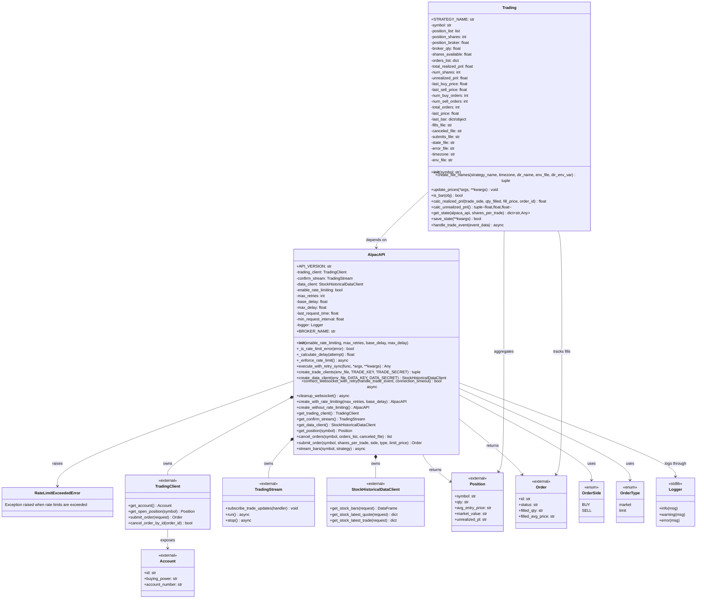

<!-- 
Run these commands in the terminal to generate HTML and SVG files from this Markdown file:
pandoc -s /Users/jerzy/Develop/Python/AlpacaSDK/README.md -o /Users/jerzy/Develop/Python/AlpacaSDK/README.html
npx -y @mermaid-js/mermaid-cli -i /Users/jerzy/Develop/Python/AlpacaSDK/class-diagram.mmd -o /Users/jerzy/Develop/Python/AlpacaSDK/class-diagram.svg
-->

# AlpacaSDK

[](https://www.python.org/downloads/)
[](https://alpaca.markets/)
[](LICENSE)
[]()

> **Object-Oriented Wrapper for Alpaca Trading API**

AlpacaSDK is a comprehensive, object-oriented Python wrapper for the Alpaca Markets API that simplifies algorithmic trading operations. Built with professional-grade architecture, it provides unified access to trading, streaming, and market data functionality with robust error handling and flexible configuration management.

## 🚀 **Key Features**

### **🎯 Core Functionality**
- **`AlpacaSDK`** - Single class interface for all Alpaca API operations
- **Trading Client** - Execute market and limit orders with comprehensive validation
- **Streaming Client** - Real-time trade confirmations and updates
- **Data Client** - Historical market data access and processing
- **Position Management** - Real-time position tracking and monitoring
- **Order Management** - Advanced order placement, cancellation, and tracking

### **💡 Advanced Capabilities**
- ✅ **Flexible Authentication** - Multiple environment file support and custom key names
- ✅ **Error Handling** - Robust exception handling with detailed error logging
- ✅ **CSV Integration** - Automatic order and error logging to CSV files
- ✅ **State Management** - Persistent client instances with lazy initialization
- ✅ **Type Safety** - Full type hints and validation for all operations
- ✅ **Production Ready** - Designed for both paper trading and live markets

## 📦 **Installation**

### **Requirements**
```bash
# Core Dependencies
pip install alpaca-py pandas python-dotenv

# Optional: For enhanced logging and data processing
pip install numpy matplotlib
```

### **Quick Install**
```bash
# Install from source
git clone https://github.com/your-username/AlpacaSDK.git
cd AlpacaSDK
pip install -e .
```

### **Integration with MachineTrader**
AlpacaSDK is designed to work seamlessly with the MachineTrader framework:
```bash
# Install both packages
pip install -e MachineTrader/
pip install -e AlpacaSDK/
```

## 🏗️ **Architecture Overview**

```
AlpacaSDK/
├── __init__.py          # Package initialization and exports
├── alpacasdk.py         # Core AlpacaSDK class implementation
└── README.md           # This documentation

Core Dependencies:
├── alpaca-py           # Official Alpaca Python SDK
├── pandas              # Data manipulation and CSV handling  
├── python-dotenv       # Environment variable management
└── zoneinfo            # Timezone handling for market hours
```

## 📊 **Class Diagram**

[Open standalone SVG version](class-diagram.svg)



<!-- Mermaid renderer for Pandoc-generated HTML output -->
<script src="https://cdn.jsdelivr.net/npm/mermaid@10/dist/mermaid.min.js"></script>
<script>
document.addEventListener("DOMContentLoaded", function () {
    const styleId = "mermaid-static-styles";
    if (!document.getElementById(styleId)) {
        const style = document.createElement("style");
        style.id = styleId;
        style.textContent = [
            ".mermaid, .mermaid svg { font-size: 1em; font-family: inherit; }",
            ".mermaid .label, .mermaid .nodeLabel, .mermaid .classTitle, .mermaid .classText { font-size: 1em !important; font-family: inherit !important; }",
            ".mermaid .edgePath path, .mermaid .relation { stroke-linejoin: round; stroke-linecap: round; }"
        ].join("\n");
        document.head.appendChild(style);
    }

    const toRender = [];

    document.querySelectorAll("pre.mermaid, pre code.language-mermaid, pre code.mermaid, code.language-mermaid, code.mermaid").forEach(function (node) {
        const text = node.textContent || "";
        if (!text.trim()) {
            return;
        }

        const parentPre = node.matches("pre") ? node : node.closest("pre");
        const replaceTarget = parentPre || node;

        const container = document.createElement("div");
        container.className = "mermaid";
        container.textContent = text;
        replaceTarget.replaceWith(container);
        toRender.push(container);
    });

    mermaid.initialize({
        startOnLoad: false,
        securityLevel: "loose",
        themeVariables: {
            fontSize: "16px",
            fontFamily: "inherit"
        },
        class: {
            curve: "basis",
            diagramPadding: 16,
            nodeSpacing: 80,
            rankSpacing: 80,
            padding: 28,
            useMaxWidth: false
        }
    });

    if (toRender.length > 0) {
        mermaid.run({ nodes: toRender });
    }
});
</script>

## 🎯 **Quick Start**

### **1. Basic Setup**
```python
from AlpacaSDK import AlpacaSDK

# Initialize the SDK
sdk = AlpacaSDK()

# Create trading clients (uses default .env file)
trading_client, confirm_stream = sdk.create_trade_clients()

# Create data client for historical data
data_client = sdk.create_data_client()
```

### **2. Environment Configuration**
Create a `.env` file in your project root:
```bash
# Trading API Keys
ALPACA_TRADE_KEY=your_trading_api_key
ALPACA_TRADE_SECRET=your_trading_secret_key

# Data API Keys (for market data)
DATA_KEY=your_data_api_key
DATA_SECRET=your_data_secret_key

# Base URL (paper trading vs live)
ALPACA_BASE_URL=https://paper-api.alpaca.markets
```

### **3. Simple Trading Example**
```python
from AlpacaSDK import AlpacaSDK
from alpaca.trading.enums import OrderSide

# Initialize and setup clients
sdk = AlpacaSDK()
sdk.create_trade_clients()

# Check current position
position = sdk.get_position("AAPL")
print(f"Current AAPL position: {position.qty if position else 0} shares")

# Submit a market buy order
order = sdk.submit_order(
    symbol="AAPL",
    shares_per_trade=10,
    side=OrderSide.BUY,
    type="market",
    limit_price=None,
    submits_file="orders.csv",
    error_file="errors.csv"
)

if order:
    print(f"Order submitted: {order.id}")
```

## 📚 **Detailed Documentation**

### **AlpacaSDK Class**

The `AlpacaSDK` class is the main interface for all Alpaca API operations, providing a unified, object-oriented approach to trading and data access.

```python
from AlpacaSDK import AlpacaSDK

# Initialize the SDK
sdk = AlpacaSDK()
```

#### **Client Management Methods**

##### **`create_trade_clients(env_file=None, TRADE_KEY="ALPACA_TRADE_KEY", TRADE_SECRET="ALPACA_TRADE_SECRET")`**

Creates and initializes trading and streaming clients.

**Parameters:**
- `env_file` (str, optional): Path to environment file. If `None`, uses default `.env` or system environment
- `TRADE_KEY` (str): Environment variable name for trading API key
- `TRADE_SECRET` (str): Environment variable name for trading API secret

**Returns:**
- `tuple`: (trading_client, confirm_stream) - Initialized SDK clients

**Examples:**
```python
# Use default .env file
trading_client, stream = sdk.create_trade_clients()

# Use custom environment file
trading_client, stream = sdk.create_trade_clients("/path/to/production.env")

# Use custom environment variable names
trading_client, stream = sdk.create_trade_clients(
    TRADE_KEY="MY_TRADE_KEY",
    TRADE_SECRET="MY_TRADE_SECRET"
)
```

##### **`create_data_client(env_file=None, DATA_KEY="DATA_KEY", DATA_SECRET="DATA_SECRET")`**

Creates and configures the data client for historical market data access.

**Parameters:**
- `env_file` (str, optional): Path to environment file
- `DATA_KEY` (str): Environment variable name for data API key  
- `DATA_SECRET` (str): Environment variable name for data API secret

**Returns:**
- `StockHistoricalDataClient`: Configured data client instance

**Examples:**
```python
# Create data client with default settings
data_client = sdk.create_data_client()

# Use custom environment file
data_client = sdk.create_data_client("/path/to/data.env")

# Use custom environment variable names
data_client = sdk.create_data_client(
    DATA_KEY="CUSTOM_DATA_KEY",
    DATA_SECRET="CUSTOM_DATA_SECRET"
)
```

#### **Client Access Methods**

##### **`get_trading_client()`**
Returns the initialized trading client instance.

```python
client = sdk.get_trading_client()
# Use client for direct API calls
account = client.get_account()
```

##### **`get_confirm_stream()`**
Returns the trading stream for order confirmations.

```python
stream = sdk.get_confirm_stream()
# Subscribe to trade updates
stream.subscribe_trade_updates(handle_trade_update)
```

##### **`get_data_client()`**
Returns the historical data client instance.

```python
data_client = sdk.get_data_client()
# Fetch historical bars
bars = data_client.get_stock_bars(...)
```

#### **Trading Operations**

##### **`get_position(symbol)`**

Retrieves the current open position for a trading symbol.

**Parameters:**
- `symbol` (str): Trading symbol (e.g., "AAPL", "SPY")

**Returns:**
- `Position`: Position object with quantity, average price, etc., or `None` if no position

**Examples:**
```python
# Check AAPL position
position = sdk.get_position("AAPL")
if position:
    print(f"AAPL: {position.qty} shares @ ${position.avg_entry_price}")
    print(f"Market value: ${position.market_value}")
    print(f"Unrealized P&L: ${position.unrealized_pl}")
else:
    print("No AAPL position found")
```

##### **`submit_order(symbol, shares_per_trade, side, type, limit_price, submits_file, error_file)`**

Submits a trading order with comprehensive logging and error handling.

**Parameters:**
- `symbol` (str): Trading symbol
- `shares_per_trade` (int): Number of shares to trade
- `side` (OrderSide): Order side (`OrderSide.BUY` or `OrderSide.SELL`)
- `type` (str): Order type (`"market"` or `"limit"`)
- `limit_price` (float): Limit price for limit orders (ignored for market orders)
- `submits_file` (str): Path to CSV file for successful order logging
- `error_file` (str): Path to CSV file for error logging

**Returns:**
- `Order`: Order response object if successful, `None` if failed

**Examples:**
```python
from alpaca.trading.enums import OrderSide

# Market buy order
order = sdk.submit_order(
    symbol="AAPL",
    shares_per_trade=100,
    side=OrderSide.BUY,
    type="market",
    limit_price=None,
    submits_file="successful_orders.csv",
    error_file="failed_orders.csv"
)

# Limit sell order
order = sdk.submit_order(
    symbol="TSLA", 
    shares_per_trade=50,
    side=OrderSide.SELL,
    type="limit",
    limit_price=250.00,
    submits_file="orders.csv",
    error_file="errors.csv"
)

if order:
    print(f"Order {order.id} submitted successfully")
    print(f"Status: {order.status}")
else:
    print("Order submission failed - check error log")
```

##### **`cancel_orders(symbol, orders_list=None, canceled_file=None)`**

Cancels orders for a specific symbol with flexible targeting options.

**Parameters:**
- `symbol` (str): Trading symbol
- `orders_list` (list, optional): Specific order IDs to cancel. If `None`, cancels all open orders for symbol
- `canceled_file` (str, optional): Path to CSV file to save canceled order information

**Returns:**
- `list`: Updated orders list with remaining orders after cancellation

**Examples:**
```python
# Cancel all open orders for AAPL
remaining_orders = sdk.cancel_orders("AAPL")

# Cancel specific orders
order_ids = ["order_id_1", "order_id_2"]
remaining_orders = sdk.cancel_orders("SPY", orders_list=order_ids)

# Cancel with logging
remaining_orders = sdk.cancel_orders(
    "TSLA",
    canceled_file="canceled_orders.csv"
)

print(f"Remaining open orders: {len(remaining_orders)}")
```

## 🔧 **Configuration Management**

### **Environment Files**

AlpacaSDK supports flexible environment configuration:

#### **Default .env Configuration**
```bash
# Place in project root as .env
ALPACA_TRADE_KEY=PKB...
ALPACA_TRADE_SECRET=abc123...
DATA_KEY=PK...  
DATA_SECRET=def456...
```

#### **Multiple Environment Files**
```python
# Development environment
sdk.create_trade_clients("/path/to/dev.env")

# Production environment  
sdk.create_trade_clients("/path/to/prod.env")

# Testing environment
sdk.create_trade_clients("/path/to/test.env")
```

#### **Custom Environment Variable Names**
```python
# If your .env uses different key names
sdk.create_trade_clients(
    TRADE_KEY="MY_ALPACA_KEY",
    TRADE_SECRET="MY_ALPACA_SECRET"
)

sdk.create_data_client(
    DATA_KEY="MY_DATA_API_KEY", 
    DATA_SECRET="MY_DATA_API_SECRET"
)
```

### **Error Handling and Logging**

#### **Automatic Error Logging**
```python
# Orders and errors are automatically logged to CSV files
order = sdk.submit_order(
    symbol="AAPL",
    shares_per_trade=100,
    side=OrderSide.BUY,
    type="market",
    limit_price=None,
    submits_file="trade_log.csv",      # Successful orders
    error_file="error_log.csv"         # Failed orders with details
)
```

#### **Exception Handling**
```python
try:
    sdk.create_trade_clients()
    trading_client = sdk.get_trading_client()
except ValueError as e:
    print(f"Configuration error: {e}")
except Exception as e:
    print(f"Unexpected error: {e}")
```

## 🔄 **Integration Examples**

### **With MachineTrader Framework**

AlpacaSDK integrates seamlessly with the MachineTrader package:

```python
from MachineTrader import CreateStrategy
from AlpacaSDK import AlpacaSDK

# Strategy uses AlpacaSDK internally
strategy = CreateStrategy(
    symbol="AAPL",
    shares_per_trade=100,
    strategy_name="AAPL_Momentum"
)

# Direct SDK access for advanced operations
sdk = strategy.sdk  # Access the underlying AlpacaSDK instance
position = sdk.get_position("AAPL")
```

### **Real-time Trading Loop**

```python
import asyncio
from AlpacaSDK import AlpacaSDK
from alpaca.trading.enums import OrderSide

async def trading_bot():
    sdk = AlpacaSDK()
    sdk.create_trade_clients()
    
    # Main trading loop
    while True:
        try:
            # Check positions
            position = sdk.get_position("SPY")
            
            # Implement your trading logic here
            if should_buy():
                order = sdk.submit_order(
                    symbol="SPY",
                    shares_per_trade=100,
                    side=OrderSide.BUY,
                    type="market",
                    limit_price=None,
                    submits_file="bot_orders.csv",
                    error_file="bot_errors.csv"
                )
                
            await asyncio.sleep(1)  # 1-second interval
            
        except Exception as e:
            print(f"Trading loop error: {e}")
            await asyncio.sleep(5)  # Wait before retrying

# Run the trading bot
asyncio.run(trading_bot())
```

### **Portfolio Management**

```python
from AlpacaSDK import AlpacaSDK

def portfolio_summary():
    sdk = AlpacaSDK()
    sdk.create_trade_clients()
    
    symbols = ["AAPL", "TSLA", "SPY", "QQQ"]
    total_value = 0
    
    print("📊 Portfolio Summary")
    print("=" * 50)
    
    for symbol in symbols:
        position = sdk.get_position(symbol)
        if position:
            value = float(position.market_value)
            total_value += value
            print(f"{symbol:6} | {position.qty:>8} shares | ${value:>10,.2f}")
        else:
            print(f"{symbol:6} | {'0':>8} shares | ${'0.00':>10}")
    
    print("=" * 50)
    print(f"{'TOTAL':6} | {' ':>8} | ${total_value:>10,.2f}")

# Run portfolio summary
portfolio_summary()
```

## 🧪 **Testing & Development**

### **Testing API Connection**

```python
from AlpacaSDK import AlpacaSDK

def test_connection():
    """Test API connection and credentials"""
    try:
        sdk = AlpacaSDK()
        sdk.create_trade_clients()
        
        # Test trading client
        client = sdk.get_trading_client()
        account = client.get_account()
        print(f"✅ Trading API connected - Account: {account.id}")
        
        # Test data client
        sdk.create_data_client()
        data_client = sdk.get_data_client()
        print("✅ Data API connected")
        
        return True
        
    except Exception as e:
        print(f"❌ Connection failed: {e}")
        return False

# Test your setup
test_connection()
```

### **Paper Trading Verification**

```python
def verify_paper_trading():
    """Verify you're connected to paper trading (not live)"""
    sdk = AlpacaSDK()
    sdk.create_trade_clients()
    
    client = sdk.get_trading_client()
    account = client.get_account()
    
    # Check if account is paper trading
    if hasattr(account, 'account_number'):
        if 'PA' in str(account.account_number):  # Paper accounts start with PA
            print("✅ Connected to PAPER TRADING account")
        else:
            print("⚠️  WARNING: Connected to LIVE TRADING account")
    
    print(f"Account ID: {account.id}")
    print(f"Buying Power: ${account.buying_power}")

verify_paper_trading()
```

## 📊 **CSV Data Management**

### **Order Logging**

AlpacaSDK automatically logs all order activity to CSV files:

```python
# Successful orders logged to this file
successful_orders = "successful_orders.csv"

# Failed orders logged to this file  
failed_orders = "failed_orders.csv"

# Canceled orders logged to this file
canceled_orders = "canceled_orders.csv"

# Submit order with logging
order = sdk.submit_order(
    symbol="AAPL",
    shares_per_trade=100,
    side=OrderSide.BUY,
    type="market", 
    limit_price=None,
    submits_file=successful_orders,
    error_file=failed_orders
)

# Cancel orders with logging
sdk.cancel_orders("AAPL", canceled_file=canceled_orders)
```

### **CSV Data Analysis**

```python
import pandas as pd

# Analyze order history
def analyze_orders():
    # Load order data
    orders_df = pd.read_csv("successful_orders.csv")
    errors_df = pd.read_csv("failed_orders.csv")
    
    print("📈 Order Analysis")
    print(f"Total successful orders: {len(orders_df)}")
    print(f"Total failed orders: {len(errors_df)}")
    
    # Success rate
    total_attempts = len(orders_df) + len(errors_df)
    success_rate = len(orders_df) / total_attempts * 100
    print(f"Success rate: {success_rate:.1f}%")
    
    # Order breakdown by symbol
    symbol_counts = orders_df['symbol'].value_counts()
    print("\nOrders by symbol:")
    print(symbol_counts)

analyze_orders()
```

## 🚀 **Best Practices**

### **1. Client Initialization**
```python
# Initialize clients once and reuse
class TradingManager:
    def __init__(self):
        self.sdk = AlpacaSDK()
        self.sdk.create_trade_clients()
        self.sdk.create_data_client()
    
    def execute_trade(self, symbol, quantity):
        # Use existing clients
        return self.sdk.submit_order(...)

# Create manager instance
manager = TradingManager()
```

### **2. Error Handling**
```python
# Always handle potential errors
def safe_order_submission(sdk, symbol, quantity):
    try:
        order = sdk.submit_order(
            symbol=symbol,
            shares_per_trade=quantity,
            side=OrderSide.BUY,
            type="market",
            limit_price=None,
            submits_file="orders.csv",
            error_file="errors.csv"
        )
        return order
    except Exception as e:
        print(f"Order submission failed: {e}")
        return None
```

### **3. Environment Management**
```python
# Use different configs for different environments
import os

env = os.getenv("TRADING_ENV", "development")

if env == "production":
    sdk.create_trade_clients("/path/to/prod.env")
elif env == "staging":
    sdk.create_trade_clients("/path/to/staging.env") 
else:
    sdk.create_trade_clients()  # Use default dev config
```

## 🔍 **Troubleshooting**

### **Common Issues**

**1. Authentication Errors**
```python
# Check API key format and permissions
try:
    sdk.create_trade_clients()
except ValueError as e:
    print(f"Authentication failed: {e}")
    # Verify .env file exists and contains correct keys
```

**2. Network Connectivity**
```python
# Test basic connectivity
import requests

def test_alpaca_connectivity():
    try:
        response = requests.get("https://paper-api.alpaca.markets/v2/account")
        print(f"API reachable: {response.status_code}")
    except Exception as e:
        print(f"Network error: {e}")

test_alpaca_connectivity()
```

**3. Order Rejection**
```python
# Common reasons for order rejection:
# - Insufficient buying power
# - Market closed
# - Invalid symbol
# - Minimum order size not met

position = sdk.get_position(symbol)
account = sdk.get_trading_client().get_account()
print(f"Buying power: {account.buying_power}")
print(f"Current position: {position.qty if position else 0}")
```

### **Debug Mode**
```python
import logging

# Enable detailed logging
logging.basicConfig(level=logging.DEBUG)

# SDK will now provide verbose output
sdk = AlpacaSDK()
sdk.create_trade_clients()
```

## 📄 **License**

This project is licensed under the MIT License - see the [LICENSE](LICENSE) file for details.

## 🙏 **Acknowledgments**

- **Alpaca Markets** - For providing the comprehensive trading API
- **Alpaca-py Team** - For the excellent official Python SDK
- **Python Community** - For the robust ecosystem of financial tools

## 📞 **Support**

- **Documentation**: [Alpaca API Docs](https://alpaca.markets/docs/)
- **Issues**: [GitHub Issues](https://github.com/your-username/AlpacaSDK/issues)
- **Community**: [Alpaca Community](https://alpaca.markets/community)
- **Email**: support@alpacasdk.com

---

**⚠️ Important Notice:** This SDK is designed for both paper trading and live trading. Always verify you're connected to the correct environment (paper vs live) before executing trades. Paper trading is recommended for development and testing.

---

<div align="center">

**Built for Professional Algorithmic Trading**

[⭐ Star us on GitHub](https://github.com/your-username/AlpacaSDK) | [🐛 Report Bug](https://github.com/your-username/AlpacaSDK/issues) | [💡 Request Feature](https://github.com/your-username/AlpacaSDK/issues)

</div>
