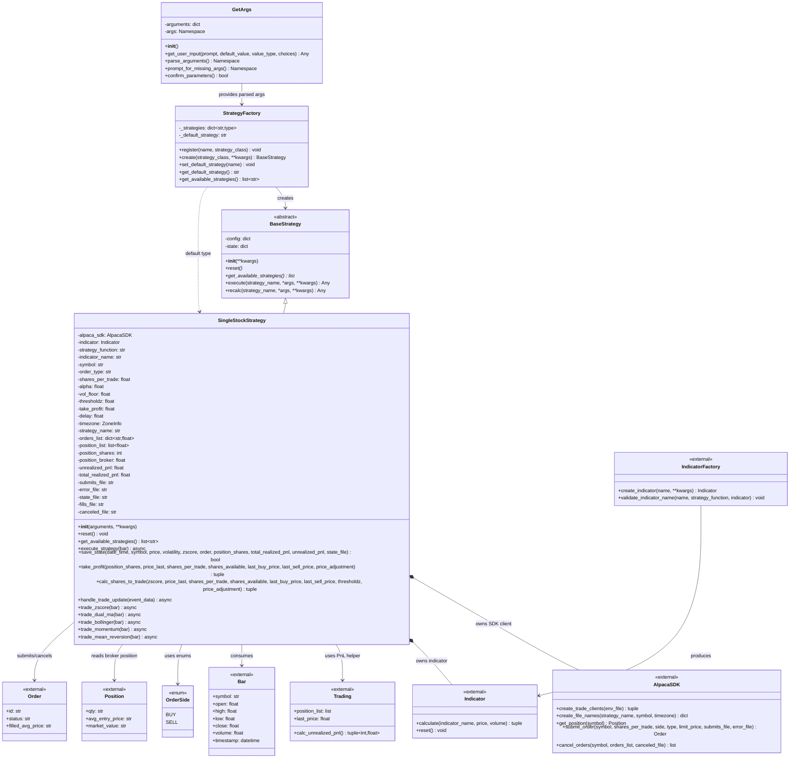

<!-- 
Run these commands in the terminal to generate HTML and SVG files from this Markdown file:
pandoc -s /Users/jerzy/Develop/Python/MachineTrader/README.md -o /Users/jerzy/Develop/Python/MachineTrader/README.html
npx -y @mermaid-js/mermaid-cli -i /Users/jerzy/Develop/Python/MachineTrader/class-diagram.mmd -o /Users/jerzy/Develop/Python/MachineTrader/class-diagram.svg
-->

# MachineTrader

[](https://www.python.org/downloads/)
[](LICENSE)
[]()
[]()

> **Advanced Algorithmic Trading Framework for Alpaca Markets**

MachineTrader is a sophisticated, object-oriented trading framework designed for algorithmic trading strategies using the Alpaca API. Built with professional-grade architecture, it provides comprehensive tools for argument parsing, strategy creation, and real-time market data processing.

## 🚀 **Key Features**

### **🎯 Core Components**
- **`GetArgs`** - Advanced command-line argument parsing with interactive mode
- **`SingleStrategy`** - Flexible trading strategy implementation framework  
- **`Bar`** - Real-time price bar processing and normalization
- **Integrated SDK** - Seamless Alpaca API integration via AlpacaSDK
- **Technical Indicators** - Built-in technical analysis through TechIndic

### **💡 Advanced Capabilities**
- ✅ **Multiple Strategy Support** - Z-score, moving average, and custom strategies
- ✅ **Real-time Data Processing** - WebSocket streaming with automatic reconnection
- ✅ **Risk Management** - Built-in position sizing and take-profit mechanisms
- ✅ **Timezone Handling** - Intelligent market timezone conversion
- ✅ **Environment Management** - Flexible API key and configuration handling
- ✅ **Interactive CLI** - User-friendly command-line interface with validation
- ✅ **Error Handling** - Robust error recovery and logging

## 📦 **Installation**

### **Quick Install**
```bash
# Clone the repository
git clone https://github.com/your-username/MachineTrader.git
cd MachineTrader

# Install using the comprehensive Makefile
make install
```

### **Development Setup**
```bash
# Complete development environment
make dev-setup

# Activate virtual environment
source .venv/bin/activate

# Verify installation
make quick-test
```

### **Manual Installation**
```bash
# Install dependencies
pip install pandas numpy websockets python-dotenv alpaca-py matplotlib requests

# Install in development mode
pip install -e .
```

## 🏗️ **Architecture Overview**

```
MachineTrader/
├── __init__.py          # Package initialization and exports
├── trading.py           # Core trading classes and functionality
└── README.md           # This file

Dependencies:
├── AlpacaSDK/          # Alpaca API integration layer
├── TechIndic/          # Technical indicators and risk metrics
└── utils.py            # Utility functions and helpers
```

## 📊 **Class Diagram**

[Open standalone SVG version](class-diagram.svg)



<!-- Mermaid renderer for Pandoc-generated HTML output -->
<script src="https://cdn.jsdelivr.net/npm/mermaid@10/dist/mermaid.min.js"></script>
<script>
document.addEventListener("DOMContentLoaded", function () {
    const styleId = "mermaid-static-styles";
    if (!document.getElementById(styleId)) {
        const style = document.createElement("style");
        style.id = styleId;
        style.textContent = [
            ".mermaid, .mermaid svg { font-size: 1em; font-family: inherit; }",
            ".mermaid .label, .mermaid .nodeLabel, .mermaid .classTitle, .mermaid .classText { font-size: 1em !important; font-family: inherit !important; }",
            ".mermaid .edgePath path, .mermaid .relation { stroke-linejoin: round; stroke-linecap: round; }"
        ].join("\n");
        document.head.appendChild(style);
    }

    const toRender = [];

    document.querySelectorAll("pre.mermaid, pre code.language-mermaid, pre code.mermaid, code.language-mermaid, code.mermaid").forEach(function (node) {
        const text = node.textContent || "";
        if (!text.trim()) {
            return;
        }

        const parentPre = node.matches("pre") ? node : node.closest("pre");
        const replaceTarget = parentPre || node;

        const container = document.createElement("div");
        container.className = "mermaid";
        container.textContent = text;
        replaceTarget.replaceWith(container);
        toRender.push(container);
    });

    mermaid.initialize({
        startOnLoad: false,
        securityLevel: "loose",
        themeVariables: {
            fontSize: "16px",
            fontFamily: "inherit"
        },
        class: {
            curve: "basis",
            diagramPadding: 16,
            nodeSpacing: 80,
            rankSpacing: 80,
            padding: 28,
            useMaxWidth: false
        }
    });

    if (toRender.length > 0) {
        mermaid.run({ nodes: toRender });
    }
});
</script>

## 🎯 **Quick Start**

### **1. Basic Usage**
```python
from MachineTrader import GetArgs, SingleStrategy

# Parse command line arguments
args_handler = GetArgs()
args = args_handler.parse_arguments()

# Create trading strategy
strategy = SingleStrategy(arguments=args_handler.arguments)

print(f"Strategy '{strategy.strategy_name}' ready for {strategy.symbol}")
```

### **2. Command Line Interface**
```bash
# Z-score strategy for AAPL with custom parameters
python trading.py trade_zscore AAPL --shares_per_trade 100 --alpha 0.8 --thresholdz 2.0

# Moving average strategy with limit orders
python trading.py trade_moving_avg SPY --type limit --strategy_name "SPY_MA_Strategy"

# Interactive mode for guided setup
python trading.py --interactive
```

### **3. Direct Strategy Creation**
```python
from MachineTrader import SingleStrategy

# Create strategy with direct parameters
strategy = SingleStrategy(
    symbol="TSLA",
    shares_per_trade=50,
    strategy_name="Tesla_Momentum",
    alpha=0.6,
    type="market"
)

# Access strategy properties
print(f"Trading {strategy.symbol} with {strategy.shares_per_trade} shares")
```

## 📚 **Detailed Documentation**

### **GetArgs Class**

The `GetArgs` class provides sophisticated command-line argument parsing with validation and interactive mode support.

```python
from MachineTrader import GetArgs

# Initialize argument parser
args_handler = GetArgs()

# Parse command line arguments
args = args_handler.parse_arguments()

# Access parsed arguments
print(args_handler.arguments['symbol'])  # Trading symbol
print(args_handler.arguments['shares_per_trade'])  # Position size
```

#### **Supported Arguments**
| Parameter | Type | Default | Description |
|-----------|------|---------|-------------|
| `strategy_function` | str | Required | Strategy type (`trade_zscore`, `trade_moving_avg`) |
| `symbol` | str | Required | Trading symbol (e.g., `AAPL`, `SPY`) |
| `shares_per_trade` | int | 10 | Number of shares per trade |
| `strategy_name` | str | Auto-generated | Custom strategy identifier |
| `alpha` | float | 0.5 | EMA decay factor (0 < α ≤ 1) |
| `type` | str | "market" | Order type (`market` or `limit`) |
| `thresholdz` | float | 1.0 | Z-score threshold for trade signals |
| `take_profit` | float | 1.05 | Take profit multiplier |
| `delay` | float | 0.0 | Delay before order submission (seconds) |
| `timezone` | str | "America/New_York" | Market timezone |

#### **Interactive Mode**
```bash
python trading.py --interactive
```
Launches an interactive session where users are prompted for each parameter with validation and default values.

### **SingleStrategy Class**

The `SingleStrategy` class implements trading strategies with comprehensive state management and risk controls.

```python
from MachineTrader import SingleStrategy

# Using arguments dictionary (recommended)
strategy = SingleStrategy(arguments=args_handler.arguments)

# Direct instantiation (backward compatibility)
strategy = SingleStrategy(
    symbol="AAPL",
    shares_per_trade=100,
    alpha=0.7,
    strategy_name="AAPL_Scalping"
)
```

#### **Strategy Methods**
- **`trade_zscore(bar)`** - Z-score mean reversion strategy
- **`trade_moving_avg(bar)`** - Moving average crossover strategy  
- **`submit_trade(side, shares)`** - Execute trade with risk management
- **`calculate_signals(bar)`** - Generate trading signals from price data
- **`update_indicators(bar)`** - Update technical indicators with new data

#### **Properties**
```python
strategy.symbol              # Trading symbol
strategy.shares_per_trade    # Position size
strategy.strategy_name       # Strategy identifier
strategy.alpha              # EMA decay parameter
strategy.current_position   # Current position size
strategy.unrealized_pnl     # Unrealized profit/loss
strategy.trade_count        # Number of trades executed
```

### **Bar Class**

The `Bar` class normalizes price data from different sources into a consistent format.

```python
from MachineTrader import Bar

# Create from WebSocket data
websocket_data = {
    "S": "AAPL",      # Symbol
    "o": "150.25",    # Open
    "h": "151.00",    # High  
    "l": "149.50",    # Low
    "c": "150.75",    # Close
    "v": "1000"       # Volume
}
bar = Bar(websocket_data)

# Create from processed data
processed_data = {
    "symbol": "AAPL",
    "open": 150.25,
    "high": 151.00,
    "low": 149.50,
    "close": 150.75,
    "volume": 1000
}
bar = Bar(processed_data)

# Access normalized properties
print(f"{bar.symbol}: O={bar.open} H={bar.high} L={bar.low} C={bar.close} V={bar.volume}")
```

## 🔧 **Configuration**

### **Environment Variables**

Create a `.env` file in your project root:

```bash
# Alpaca API Configuration
ALPACA_BASE_URL=https://paper-api.alpaca.markets
ALPACA_TRADE_KEY=your_trade_api_key
ALPACA_TRADE_SECRET=your_trade_secret_key

# Data API Keys (for market data)
DATA_KEY=your_data_api_key
DATA_SECRET=your_data_secret_key
```

### **Custom Environment Files**
```python
# Use custom .env file location
strategy = SingleStrategy(
    symbol="SPY",
    env_file="/path/to/custom/.env"
)

# Use custom environment variable names
strategy = SingleStrategy(
    symbol="SPY",
    trade_key="MY_CUSTOM_TRADE_KEY",
    trade_secret="MY_CUSTOM_TRADE_SECRET"
)
```

## 📊 **Trading Strategies**

### **Z-Score Mean Reversion Strategy**

Identifies overbought/oversold conditions using z-score calculations:

```bash
# Basic z-score strategy
python trading.py trade_zscore AAPL --thresholdz 2.0

# Advanced parameters
python trading.py trade_zscore SPY \
    --shares_per_trade 200 \
    --alpha 0.8 \
    --thresholdz 1.5 \
    --take_profit 1.03 \
    --type limit
```

**Strategy Logic:**
- Calculates rolling z-score of price movements
- Generates buy signals when z-score < -threshold (oversold)
- Generates sell signals when z-score > threshold (overbought)
- Includes take-profit and stop-loss mechanisms

### **Moving Average Strategy**

Trend-following strategy using exponential moving averages:

```bash
# Moving average crossover
python trading.py trade_moving_avg TSLA --alpha 0.6

# Fast-moving strategy
python trading.py trade_moving_avg QQQ \
    --alpha 0.9 \
    --shares_per_trade 50 \
    --strategy_name "QQQ_Fast_MA"
```

**Strategy Logic:**
- Uses exponential moving average with configurable alpha
- Long positions when price > EMA (uptrend)
- Short positions when price < EMA (downtrend)
- Dynamic position sizing based on volatility

## 🔄 **Real-time Data Processing**

MachineTrader supports real-time market data streaming:

```python
import asyncio
from MachineTrader import SingleStrategy

async def live_trading():
    strategy = SingleStrategy(symbol="AAPL", shares_per_trade=100)
    
    # Connect to real-time data stream
    await strategy.connect_stream()
    
    # Process incoming bars
    async for bar in strategy.bar_stream:
        # Execute strategy logic
        signals = strategy.calculate_signals(bar)
        
        # Submit trades based on signals
        if signals['buy']:
            await strategy.submit_trade('buy', strategy.shares_per_trade)
        elif signals['sell']:
            await strategy.submit_trade('sell', strategy.shares_per_trade)

# Run live trading
asyncio.run(live_trading())
```

## 🛡️ **Risk Management**

### **Built-in Risk Controls**
- **Position Sizing** - Configurable shares per trade
- **Take Profit** - Automatic profit-taking at specified levels
- **Stop Loss** - Risk-based exit mechanisms
- **Maximum Position** - Prevents over-concentration
- **Volatility Floor** - Minimum volatility requirements

### **Risk Monitoring**
```python
# Monitor strategy performance
print(f"Current Position: {strategy.current_position}")
print(f"Unrealized P&L: ${strategy.unrealized_pnl:.2f}")
print(f"Trade Count: {strategy.trade_count}")
print(f"Win Rate: {strategy.win_rate:.1%}")
```

## 🧪 **Testing & Development**

### **Run Tests**
```bash
# Run all tests
make test

# Run with coverage
make coverage

# Quick validation
make quick-test
```

### **Code Quality**
```bash
# Format code
make format

# Lint code
make lint

# Type checking
make type-check

# Complete validation
make validate
```

### **Example Scripts**

Use the provided example to understand the workflow:

```bash
# Run the complete example
python getargs_singlestrategy_example.py trade_zscore AAPL \
    --shares_per_trade 10 \
    --alpha 0.8 \
    --strategy_name "MyAAPLStrategy"
```

## 📈 **Performance Monitoring**

### **Strategy Metrics**
```python
# Access performance metrics
strategy.get_performance_metrics()
# Returns: {
#     'total_trades': 156,
#     'winning_trades': 89,
#     'losing_trades': 67,
#     'win_rate': 0.571,
#     'avg_win': 0.0234,
#     'avg_loss': -0.0198,
#     'profit_factor': 1.18,
#     'sharpe_ratio': 1.45
# }
```

### **Real-time Monitoring**
```python
# Set up performance monitoring
strategy.enable_monitoring(
    log_level='INFO',
    log_file='trading.log',
    metrics_interval=60  # seconds
)
```

## 🔍 **Troubleshooting**

### **Common Issues**

**1. API Connection Errors**
```python
# Verify API keys
from AlpacaSDK import AlpacaSDK
sdk = AlpacaSDK()
print(sdk.test_connection())  # Should return True
```

**2. Import Errors**
```bash
# Check package structure
make check-structure

# Verify dependencies
make package-info
```

**3. Strategy Errors**
```python
# Enable debug logging
strategy = SingleStrategy(symbol="AAPL", debug=True)
```

### **Debug Mode**
```bash
# Run with verbose output
python trading.py trade_zscore AAPL --debug --verbose
```

## 🤝 **Contributing**

We welcome contributions to MachineTrader! Please follow these guidelines:

### **Development Workflow**
1. **Fork** the repository
2. **Create** a feature branch (`git checkout -b feature/amazing-feature`)
3. **Commit** changes (`git commit -m 'Add amazing feature'`)
4. **Test** your changes (`make validate`)
5. **Push** to branch (`git push origin feature/amazing-feature`)
6. **Open** a Pull Request

### **Code Standards**
- Follow PEP 8 style guidelines
- Include comprehensive docstrings
- Add unit tests for new features
- Maintain backward compatibility
- Use type hints where appropriate

### **Testing Requirements**
```bash
# Ensure all tests pass
make test

# Check code coverage (minimum 80%)
make coverage

# Validate code quality
make validate
```

## 📄 **License**

This project is licensed under the MIT License - see the [LICENSE](LICENSE) file for details.

## 🙏 **Acknowledgments**

- **Alpaca Markets** - For providing the excellent trading API
- **Python Community** - For the robust ecosystem of trading and analysis tools
- **Contributors** - Thanks to all developers who have contributed to this project

## 📞 **Support**

- **Documentation**: [Full Documentation](docs/)
- **Issues**: [GitHub Issues](https://github.com/your-username/MachineTrader/issues)
- **Discussions**: [GitHub Discussions](https://github.com/your-username/MachineTrader/discussions)
- **Email**: support@machinetrader.com

---

**⚠️ Disclaimer:** This software is for educational and research purposes only. Trading involves substantial risk and is not suitable for all investors. Past performance does not guarantee future results. Please consult with a qualified financial advisor before making investment decisions.

---

<div align="center">

**Built with ❤️ by the MachineTrader Team**

[⭐ Star us on GitHub](https://github.com/your-username/MachineTrader) | [🐛 Report Bug](https://github.com/your-username/MachineTrader/issues) | [💡 Request Feature](https://github.com/your-username/MachineTrader/issues)

</div>
